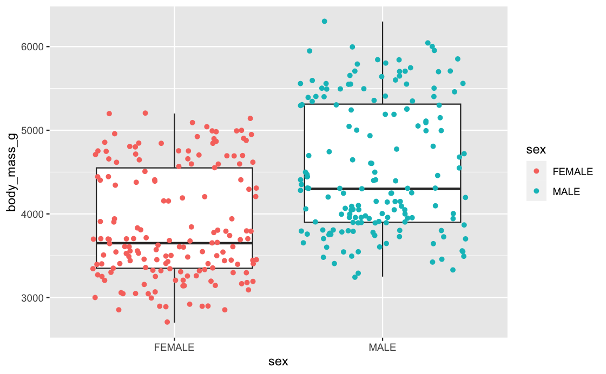

## Question 1: What is the reproducibility crisis in science and should we care?
Here is my answer:


## Question 2: Create a figure using the Palmer Penguin dataset that is correct but badly communicates the data


Written answer about the figure:

## Question 3: Discuss how colour chocie is important for communciation in science figures and what considerations should be made
Here is my written answer:


## Question 4: Run a statistical test on the Palmer Penguins dataset and produce a figure to explain it.

Here is the url to my github repo containing the rmd file with my code, functions and figures:
[Github repo](https://github.com/margretasdis/penguins/tree/main)

```{r setup, include=FALSE}
knitr::opts_chunk$set(echo = TRUE)
```

### Load the packages and raw data
```{r Load the packages}
library(palmerpenguins)
library(ggplot2)
suppressPackageStartupMessages(library(janitor))
suppressPackageStartupMessages(library(dplyr))
library(tidyr)
library(ragg)
library(svglite)

```


### Set working directory in the right place

```{r}
setwd("~/Documents/Oxford/Third year/Michaelmas 22/Rassignments/PenguinProjects")
#note this is to set it on my machine but will be different on others
```


#### Load the raw Penguin data
```{r Load the raw data}
penguins_raw <- read.csv("data_raw/penguins_raw.csv") #The location of this csv depends on where it has been saved
head(penguins_raw)
```


### Clean the data
Before running a statistical test will first use a function called cleaning to remove empty rows and remove columns called comment and delta in the raw penguin dataset This function is in the cleaning.R file that is within the functions folder.

```{r Call in cleaning function and use it to clean the penguin dataset}

source("functions/cleaning.R") #load in the cleaning file from the functions folder it is in

penguins_clean <- cleaning(penguins_raw) #run the cleaning function on the raw data and save as another dataset

# This is what the cleaning function does:
# -----------------------------------------------------------
# # Clean column names, remove empty rows, remove columns called comment and delta

# cleaning <- function(data_raw){
#   data_raw %>%
#     clean_names() %>%
#     remove_empty(c("rows", "cols")) %>%
#     select(-starts_with("delta")) %>%
#     select(-comments)
# }
# -----------------------------------------------------------

```


#### Create a csv with the newly cleaned data and take a look at the dataset

```{r Save penguin_clean in a new file}
write.csv(penguins_clean, "data_clean/penguins_clean.csv") #saves the cleaned dataset as penguins_clean in a folder called data_clean

head(penguins_clean)

```


### Run an ANCOVA statistical test on the penguins dataset
To test the main and interaction effects of species (categorical explanatory variable) and body mass (explanatory continuous variable) on the bill length (response variable)

Research question: Is there a difference in the bill length between penguins of different species (Adelie, Gentoo and Chinstrap) when we control for body mass?

First use another function to subset the data to remove missing data and only include culmen length, culmen depth and species using a function called remove_empty_culmen_data which is also within the cleaning.R file


Use this new remove_empty_culmen_data function on the penguins_clean dataset
```{r Call new function to action on the penguins_clean dataset}

source("functions/cleaning.R")
penguins_culmen <- remove_empty_culmen_data(penguins_clean) #run the remove_empty_culmen function on the cleaned data

head(penguins_culmen)


#This is what the remove_empty_culmen_data function does:
# -----------------------------------------------------------
#Remove NAs, only include culmen length, culmen depth and species, and use a function

#remove_empty_culmen_data <- function(data_clean){
#  data_clean %>%
#    filter(!is.na(culmen_length_mm)) %>%
#    filter(!is.na(body_mass_g)) %>%
#    select(species, body_mass_g, culmen_length_mm)
#}
# -----------------------------------------------------------
```


#### Fit a linear model that includes an interaction between species and body mass.
```{r Fit a linear model that includes an interaction between species and body mass}
peng_mod <- lm(culmen_length_mm ~ species * body_mass_g, penguins_culmen) #where species is the explanatory variable culmen_length_mm is the covariate and body_mass_g is the response variable

```

#### Check assumptions of the model by plotting a qqplot and a residuals vs fitted plot for the model
```{r}
plot(peng_mod, which = 2) #qqplot for the model
plot(peng_mod, which = 1) #residuals vs. fitted plot for the model
```

The qqplot does not seem to show more points than expected higher and lower than the regression line at either end or horizontal lines.
The residuals vs. fitted plot looks randomly distributed around 0 and there isn't the suggestion of a pattern in variance or where the residulas are located.
Overall, the assumptions for our model seem to be met.


#### Have a look at the summary and ANOVA tables for the model

Summary table:
```{r}
summary(peng_mod)

```
The summary table show that 29.9941 is the intercept for Adelie penguins, 32.1742 for Chinstrap, and 26.7395 for Gentoo.
The slope for Adelie penguins is 0.0031879, 0.0044627 for Chinstrap, and 0.0040909 for Gentoo.


#### ANOVA table:
```{r ANOVA table}
anova(peng_mod)

```

Based on this ANOVA table and the plot there is not a significant effect between species and body mass.
Thus, will now remove the interaction effect and run the model again.


### Linear regression - now run a linear model that does not include an interaction between species and body mass.
Based on the statistical test above (ANCOVA) there is not a significant effect between species and body mass. Thus, will now remove the interaction from our model to focus only on the main effects. That is, will do a linear regression with body mass as the explanatory variable and beak length as the response variable. 

Research question: Can we use body mass to predict bill length in these penguins?

#### Fit a linear model that includes an interaction between species and body mass.
```{r Linear model that includes an interaction between species and body mass}
peng_mod1 <- lm(culmen_length_mm ~ body_mass_g, penguins_culmen)

```


#### Have a look at the summary table for this model

```{r Summary and anova table for peng_mod1}
summary(peng_mod1)
```
From the summary table we can see that the p-value is significant (it is below 0.05) so can conclude that there is evidence we can use body mass to predict bill length in these penguin species.


### Plot a figure explaining this using a function from a file called Rplotting.R which is within the functions folder

```{r Plot a figure supporting the statisical test}

source("functions/plotting.R")

penguin_beak_plot <- plot_beak_plot(penguins_culmen)
penguin_beak_plot

#-----------------------------------------------------------
#Plot the data and linear regression lines for each separately but in the same plot. Each species is coloured differently, the alpha level is set to help see the spread of data points, regression lines ar added, the background theme is changed to black and white, new labels are made for the axes and a title is added

#plot_beak_plot <- function(penguins_culmen) {
#  penguins_culmen %>%
#  ggplot(aes(x = body_mass_g, y = culmen_length_mm, colour = species, shape = species), alpha = 0.05) +
#  geom_point(alpha = 0.7) +
#  geom_smooth(method = "lm", se = TRUE) +
#  theme_bw() +
#  labs(x = "\nBody mass (g)", y = "Beak length (mm)\n", colour = "Penguin species", shape = "Penguin species", title = 
#  "Relationship between penguin bodymass and beak length", subtitle = "Bill length and body mass for Adelie, Chinstrap and 
#  Gentoo Penguins at Palmer Station LTER") +
#  scale_color_manual(values = c("dodgerblue","darkorange2","darkorchid4"))
#}
#-----------------------------------------------------------

```


### Save the plot 

Save it both as a png and as a vector


### Save the plot as a png
```{r}
save_beak_plot_png(penguins_culmen, 
                      "figures/assignmentfigure.png", 
                      size = 20, res = 600, scaling=1)
```


#### Save the plot as a vector
```{r}
save_beak_plot_svg(penguins_culmen, "figures/assignmentfigure.svg", 
                      size = 20, scaling = 1)
```


## Bibliography


